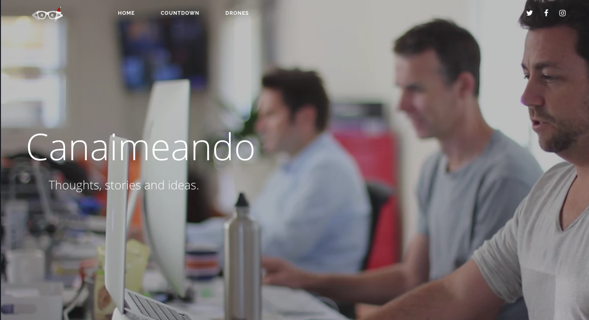

# Canaimeando for [Ghost](https://github.com/tryghost/ghost/) by Héctor Rodríguez Velsquez

> Minimalist Bootstrap Theme for [Ghost](https://github.com/tryghost/ghost/).

### Tema Gratis para Ghost Blog

Hello, I created this theme Ghost to see how it works. It is available for free so you can use on your site. It is strictly forbidden commercial use. If you have any suggestions to improve the theme,  you can send me tweet to [@HectorCanaimero](http://www.twitter.com/HectorCanaimero)

## Caracteristicas
- Responsive design
- Blog navigation
- Page 404 (Multiple faces emoticons)
- Page subscribe
- Pagination Infinite Scroll
- Cover images for blog, tag and author
- links to followers in social media
- Related Articles (6 articles)
- Video Post Format
- Image post Format
- 5 articles featured in the home of the page section sidebar
- 5 articles latest posts in the (author - tag - post) section sidebar
- 10 Tags in the sidebar
- Previous and next button in the Post
- Support for comments (Facebook or Disqus)
- Support for counter comments (Facebook or Disqus)
- Buttons to share the article
- Counter shared articles on Facebook
- YouTube, Vimeo, kickstarter -> Video Responsive
- Code syntax [Prismjs](http://prismjs.com/index.html) Supported all syntax.
